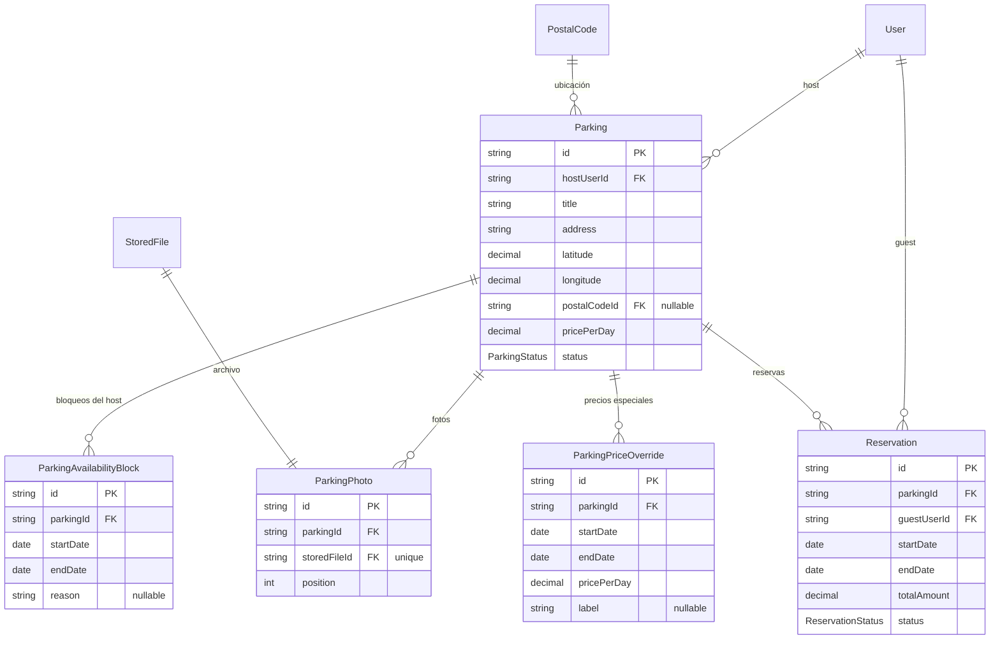
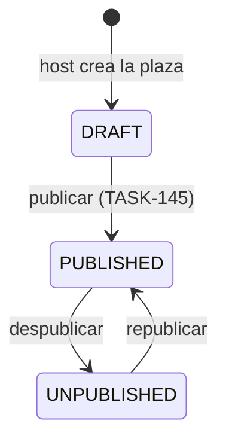
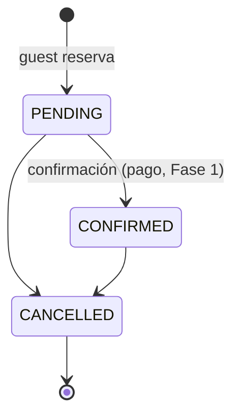

# Plazza — modelo de dominio (`parking`)

TASK-142, Fase 0. Diagrama de entidades y máquinas de estado antes de picar
el resto de las fases (TASK-145 Módulo Plazas, TASK-148 Módulo Reservas,
TASK-150/151/152 clientes).

## Entidades y relaciones

Reutiliza `User` (módulo `iam`), `PostalCode` (módulo `geo`) y `StoredFile`
(módulo `storage`) en vez de duplicarlos.

### Notas de diseño

- **Disponibilidad no es una tabla de "días disponibles"**: una plaza está
  disponible en un rango de fechas si ese rango no se solapa con ningún
  `ParkingAvailabilityBlock` (bloqueo manual del host) **ni** con ninguna
  `Reservation` en estado `PENDING`/`CONFIRMED` (`ACTIVE_RESERVATION_STATUSES`
  en `@core/shared-types`). Evita mantener una fila por día.
- **`ParkingPhoto` es 1-1 con `StoredFile`** (`storedFileId` único): cada
  archivo subido vía el módulo `storage` se usa como foto de una única plaza.
  `position` ordena la galería.
- **`postalCodeId` es opcional**: la plaza siempre lleva `address` +
  `latitude`/`longitude` en texto/coordenadas libres (necesarias para el mapa
  y el buscador de proximidad); `postalCodeId` engancha con la jerarquía de
  `geo` solo para SEO local y agregaciones administrativas.
- **`ParkingPriceOverride` sustituye el precio para las noches que cubre**
  (TASK-146): el cálculo del importe de una reserva recorre noche a noche y
  usa el override cuya fecha la cubra (el más reciente si hay varios
  solapados) o el `pricePerDay` base si no hay ninguno. Vive en
  `domain/pricing.ts` (`calculateReservationTotal`), reutilizado por
  `CreateReservationUseCase` y por `GetParkingPriceQuoteUseCase` (quote
  público sin crear reserva, para el buscador).
- Los enums y las funciones de transición (`canTransitionParkingStatus`,
  `canTransitionReservationStatus`, `blocksAvailability`) viven en
  `@core/shared-types` (`src/parking/parking.ts`), igual que el pipeline de
  `leads` — una única fuente de verdad consumida por backend y frontends.

## Máquina de estados — `Parking.status`

`DRAFT` es solo el punto de partida (mientras el host completa dirección,
fotos, precio); no se vuelve a él. Solo una plaza `PUBLISHED` es visible y
reservable (`isBookableParkingStatus`).

## Máquina de estados — `Reservation.status`

No hay estado `COMPLETED`: una reserva `CONFIRMED` cuyo `endDate` ya pasó se
considera completada por cálculo (`endDate < now()`), no por un estado propio
— evita un job que recorra reservas para cerrarlas.

## Qué queda para las siguientes fases

- **TASK-145** (Módulo Plazas): use-cases `CreateParking`, `UpdateParking`,
  `PublishParking`, `UnpublishParking`; repositorio Prisma; subida de fotos
  contra `storage`.
- **TASK-148** (Módulo Reservas): use-case `CreateReservation` con el cálculo
  de `totalAmount` (`pricePerDay × días`) y la validación de anti-solape
  descrita arriba; transiciones de `Reservation.status`.
- **TASK-155** (Verificación/KYC): probablemente un campo/tabla adicional
  sobre `User` o `Parking`, fuera de alcance de este modelo base.
